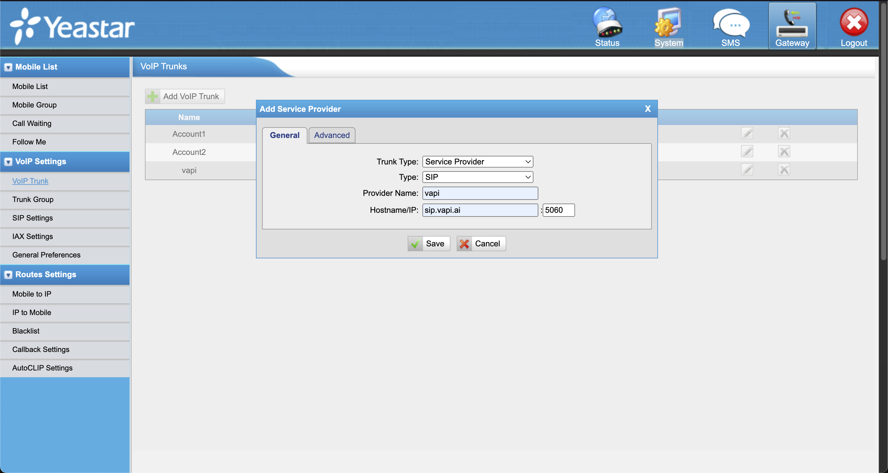

### Proyecto de Integración de Yeastar TG800 con VAPI usando SIP

---

#### Descripción del Proyecto

Este proyecto busca integrar el gateway Yeastar TG800 con la plataforma **VAPI.AI** utilizando el protocolo SIP para el manejo de llamadas. A través de esta configuración, se establecerá una conexión confiable y persistente que permita gestionar las llamadas mediante las configuraciones definidas en los archivos del dispositivo.

---

#### Requisitos Previos

1. **Hardware y Software**:
   - Gateway **Yeastar TG800**.
   - Acceso SSH habilitado en el dispositivo.
   - Conexión a internet estable para acceso a **sip.vapi.ai**.
   
2. **Datos de Configuración**:
   - **Host SIP**: `sip.vapi.ai`.
   - **User**: `{USUARIO_DE_VAPI}`.
   - **Puerto**: `5060`.
   - **Protocolos soportados**: `UDP`.
   - **Códecs**: `alaw`, `ulaw`, `gsm`.

3. **Accesos y Herramientas**:
   - Acceso al TG800 vía SSH.
   - Herramienta de conexión SSH (como `ssh` o `scp`).
   - Editor de texto (como `vim` o `nano`).

---

#### Configuración en el Yeastar TG800
##### 1. Configuración del TG800

Entramos a `System` -> `LAN Settings` para habilitar el acceso por `SSH` y configuramos la IP del dispositivo.


Ahora vamos a `Gateway` -> `VoIP Trunk`.


Agregamos el trunk con las siguientes configuraciones:  
(El *Provider Name* es importante para la configuración).  


Ahora nos conectamos por SSH al TG800.

```bash
ssh -o HostKeyAlgorithms=+ssh-rsa \
    -o KexAlgorithms=+diffie-hellman-group1-sha1 \
    -o PubkeyAcceptedAlgorithms=+ssh-rsa \
   root@192.168.5.150 

# user: root
# pass: ys123456
```

Creamos el archivo de Configuración Personalizado.

Para garantizar que la configuración persista incluso después de reinicios, los cambios se realizan en archivos personalizados dentro del directorio `/persistent/custom-cfg/`.

Creamos el archivo: `users_custom.conf` con el siguiente contenido.  
(El TG800 ya viene con el editor `vi` instalado).

```sh
vi /persistent/custom-cfg/users_custom.conf
```

Presionamos la tecla `i` para poder escribir.

Escribimos el siguiente contenido reemplazando `{USUARIO_DE_VAPI}` por el `usuario` proporcionado por la SIP de `vapi`.  
(Se recomienda colocar un nombre de usuario largo por seguridad, ya que es el único medio de autenticación para llamar a nuestro VAPI).

```conf
[trunk-sps-vapi]
defaultuser={USUARIO_DE_VAPI}
```

Presionamos la tecla `Esc` seguido de `:wq`, y luego presionamos `Enter` para guardar.

- Reiniciamos el dispositivo y ya estaríamos con la SIP Trunk conectada.
- Creamos la ruta desde el SIM hasta las SIP.
- Probamos una llamada.

By: **Servisofts SRL**,  
**Ricardo Paz Demiquel**.